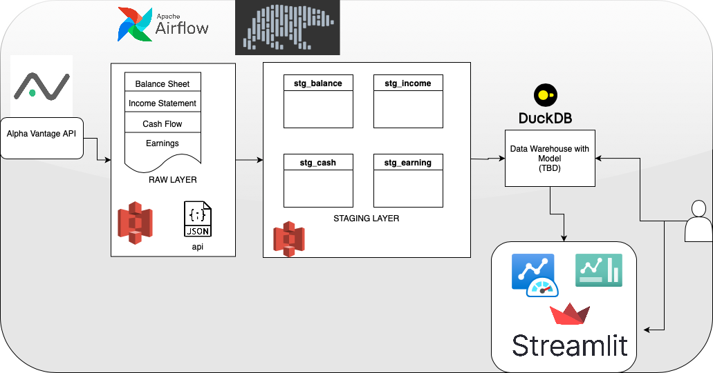
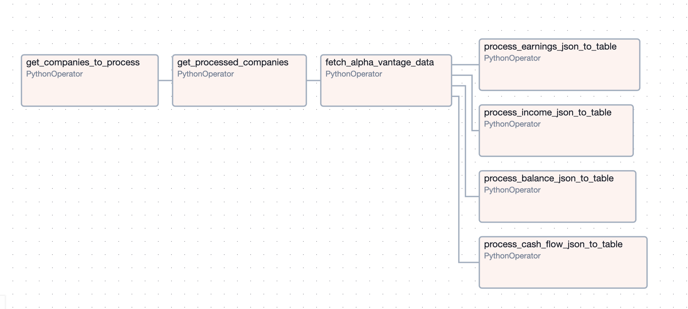

# moteFinder

This repository holds the code for the Value Investing tool.
The project is not fully complete.

# Setup

1. Setup Airflow Locally. In my case was easier to `pip install`

ToDo: Dockerize

# Architecture

# DAG

1. Read list of companies yet to process
2. Load list of processed companies
3. Fetch data for new companies and dump into the Raw layer in S3. Each company has four JSON files, one for each endpoint.
4. Read each endpoint JSON for all companies and create a table for each endpoint with all companies combined.
5. (ToDo) Create data model and tables with metrics and load into a DuckDB database for portable data warehousing for the Streamlit dashboard.